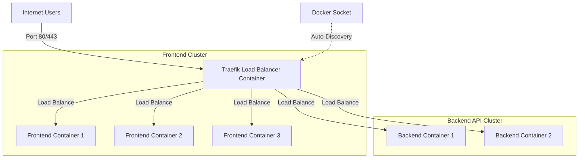

# High Availability VPS Deployment Guide (Traefik Load Balancer)

This guide explains how to set up **Traefik** as a reverse proxy on your VPS to automatically load balance traffic between multiple instances of your Next.js frontend (3 copies) and ElysiaJS backend (2 copies) with automatic Let's Encrypt SSL/HTTPS.

---

## High Availability Architecture



---

## Step 1: Create Deployment Directory
Log into your VPS and create a directory for the configuration files:

```bash
mkdir -p /app/school-ha-server
cd /app/school-ha-server
```

---

## Step 2: Create Traefik Data Directory
Traefik needs a local file to store the generated SSL certificates safely so they persist when containers are restarted:

```bash
mkdir -p traefik-data
touch traefik-data/acme.json
chmod 600 traefik-data/acme.json
```

---

## Step 3: Create your `.env` Files
Create `.env.backend` and `.env.frontend` inside `/app/school-ha-server` as detailed in the `SERVER_SETUP.md` file.

---

## Step 4: Create the Production `docker-compose.yml`
Create a `docker-compose.yml` that registers Traefik and enables dynamic load balancing labels:

```bash
nano docker-compose.yml
```

Paste the following configuration (replace `yourdomain.com` with your actual domain name):

```yaml
version: '3.8'

services:
  # ─── Traefik Load Balancer & SSL manager ───────────────────
  traefik:
    image: traefik:v3.0
    container_name: traefik-proxy
    restart: always
    command:
      # Enable docker backend (auto-discovery)
      - "--providers.docker=true"
      # Do not expose containers by default (must explicitly add labels)
      - "--providers.docker.exposedbydefault=false"
      # Expose entry points for HTTP (80) and HTTPS (443)
      - "--entrypoints.web.address=:80"
      - "--entrypoints.websecure.address=:443"
      # Global HTTP -> HTTPS redirection
      - "--entrypoints.web.http.redirections.entryPoint.to=websecure"
      - "--entrypoints.web.http.redirections.entryPoint.scheme=https"
      # Enable Let's Encrypt automatic SSL certificates
      - "--certificatesresolvers.myresolver.acme.tlschallenge=true"
      - "--certificatesresolvers.myresolver.acme.email=your-email@gmail.com" # Replace with your email
      - "--certificatesresolvers.myresolver.acme.storage=/letsexcrypt/acme.json"
    ports:
      - "80:80"
      - "443:443"
    volumes:
      # Allows Traefik to listen to Docker container spin-ups/downs
      - /var/run/docker.sock:/var/run/docker.sock:ro
      # Persist SSL certificates
      - ./traefik-data/acme.json:/letsexcrypt/acme.json
    networks:
      - web-network

  # ─── Backend ElysiaJS API Cluster ─────────────────────────
  backend:
    image: ghcr.io/YOUR_GITHUB_USERNAME/school-backend:latest
    restart: always
    env_file:
      - .env.backend
    volumes:
      - ./firebase-service-account.json:/app/firebase-service-account.json:ro
    networks:
      - web-network
    labels:
      - "traefik.enable=true"
      # Route requests coming to api.yourdomain.com to this service
      - "traefik.http.routers.backend.rule=Host(`api.yourdomain.com`)"
      - "traefik.http.routers.backend.entrypoints=websecure"
      - "traefik.http.routers.backend.tls.certresolver=myresolver"
      # Target internal container port 4000
      - "traefik.http.services.backend.loadbalancer.server.port=4000"

  # ─── Frontend Next.js Web App Cluster ──────────────────────
  frontend:
    image: ghcr.io/YOUR_GITHUB_USERNAME/school-web:latest
    restart: always
    env_file:
      - .env.frontend
    depends_on:
      - backend
    networks:
      - web-network
    labels:
      - "traefik.enable=true"
      # Route root domain AND wildcard subdomains (for school multi-tenancy)
      - "traefik.http.routers.frontend.rule=Host(`yourdomain.com`) || HostRegexp(`{subdomain:[a-z0-9-]+}.yourdomain.com`)"
      - "traefik.http.routers.frontend.entrypoints=websecure"
      - "traefik.http.routers.frontend.tls.certresolver=myresolver"
      # Target internal container port 3000
      - "traefik.http.services.frontend.loadbalancer.server.port=3000"

networks:
  web-network:
    driver: bridge
```

---

## Step 5: Start & Scale the App

### 1. Login to GHCR
Ensure the VPS is logged in to pull your private images:
```bash
echo "YOUR_PERSONAL_ACCESS_TOKEN" | docker login ghcr.io -u YOUR_GITHUB_USERNAME --password-stdin
```

### 2. Launch with Multiple Instances
To spin up **3 copies of the frontend** and **2 copies of the backend**, run:

```bash
docker compose up -d --scale frontend=3 --scale backend=2
```

### How Traefik load balances them:
*   When a request comes in for `yourdomain.com`, Traefik automatically routes it to one of the 3 running frontend containers using a round-robin algorithm.
*   When a request comes in for `api.yourdomain.com`, Traefik routes it to one of the 2 running backend containers.
*   **Self-Healing**: If one frontend container crashes, Traefik immediately stops routing users to it. Docker will restart the dead container, and the moment it comes back online, Traefik detects it and puts it back into the load-balancer pool automatically.
